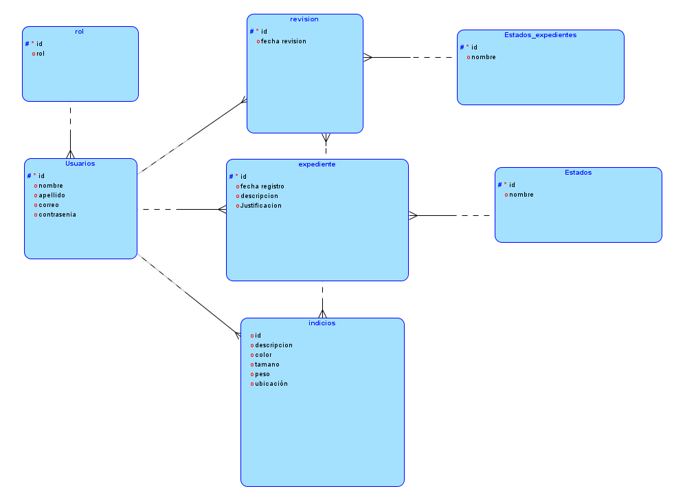

# Manual Técnico - Sistema de Gestión de Expedientes DICRI

## Tabla de Contenidos

1. [Introducción](#1-introducción)
2. [Arquitectura del Sistema](#2-arquitectura-del-sistema)
3. [Base de Datos](#3-base-de-datos)
4. [Backend - API REST](#4-backend---api-rest)
5. [Frontend - Aplicación Web](#5-frontend---aplicación-web)
6. [Despliegue y Configuración](#6-despliegue-y-configuración)
7. [Seguridad](#7-seguridad)
8. [Detección de Código Generado por IA](#8-detección-de-código-generado-por-ia)

---

## 1. Introducción

### 1.1 Propósito del Sistema

El Sistema de Gestión de Expedientes e Indicios es una aplicación web completa diseñada para el Departamento de Investigaciones Criminales (DICRI) del Ministerio Público de Guatemala. Permite la gestión integral de expedientes forenses, incluyendo el registro, seguimiento y aprobación de casos con sus indicios asociados.

### 1.2 Alcance Técnico

- **Tipo de aplicación**: Web Full-Stack
- **Patrón arquitectónico**: Cliente-Servidor con API REST
- **Base de datos**: Microsoft SQL Server 2022
- **Backend**: Node.js + Express
- **Frontend**: React 19 + Vite
- **Contenedorización**: Docker

### 1.3 Tecnologías y Versiones

| Componente | Tecnología | Versión |
|-----------|-----------|---------|
| Base de Datos | SQL Server | 2022 Developer |
| Backend Runtime | Node.js | 20.x LTS |
| Backend Framework | Express | 5.1.0 |
| Frontend Library | React | 19.2.0 |
| Build Tool | Vite | 7.2.2 |
| Contenedores | Docker | Latest |

---

## 2. Arquitectura del Sistema

### 2.1 Arquitectura de Tres Capas

```
┌──────────────────────────────────────────┐
│         CAPA DE PRESENTACIÓN             │
│                                          │
│  React 19 + Vite + TailwindCSS          │
│  - Interfaz de usuario responsiva        │
│  - Gestión de estado con hooks           │
│  - Routing con React Router              │
│                                          │
│  Puerto: 5173 (dev)        │
└────────────────┬─────────────────────────┘
                 │
                 │ HTTP/REST (Axios)
                 │ JSON
                 │
┌────────────────▼─────────────────────────┐
│          CAPA DE LÓGICA DE NEGOCIO       │
│                                          │
│  Node.js + Express                       │
│  - Controladores REST                    │
│  - Validación de datos                   │
│  - Manejo de errores                     │
│  - CORS y seguridad                      │
│                                          │
│  Puerto: 3000                            │
└────────────────┬─────────────────────────┘
                 │
                 │ mssql driver
                 │ Queries directas
                 │
┌────────────────▼─────────────────────────┐
│         CAPA DE DATOS                    │
│                                          │
│  Microsoft SQL Server 2022               │
│  - Tablas normalizadas                   │
│  - Relaciones con FK                     │
│  - Índices y constraints                 │
│                                          │
│  Puerto: 1433                            │
└──────────────────────────────────────────┘
```

### 2.2 Flujo de Datos

#### Ejemplo: Login de Usuario

```
1. Usuario ingresa credenciales en Login.jsx
   ↓
2. authService.login() encripta contraseña con MD5
   ↓
3. Axios POST /api/auth/login
   ↓
4. Backend: authController.login()
   - Valida campos
   - Conecta a BD con getConnection()
   - Query SELECT con WHERE correo y contrasenia
   ↓
5. SQL Server ejecuta query y retorna usuario
   ↓
6. Backend retorna JSON: {success, data, message}
   ↓
7. Frontend guarda en localStorage: 'usuario'
   ↓
8. Redirección a /dashboard
```

### 2.3 Patrones de Diseño Implementados

#### Backend

**MVC (Model-View-Controller)** parcial:
- **Models**: Abstraídos en la BD (tablas SQL)
- **Controllers**: `src/controllers/*.js` - Lógica de negocio
- **Routes**: `src/routes/*.js` - Definición de endpoints

**Service Layer**:
- `database.js`: Servicio de conexión y queries
- Abstracción de acceso a datos

**Middleware Pattern**:
- CORS middleware
- Error handling middleware
- Body parser middleware (express.json)

#### Frontend

**Component-Based Architecture**:
- Componentes reutilizables en `src/components/`
- Páginas en `src/pages/`
- Servicios en `src/services/`

**Service Pattern**:
- Capa de servicios para comunicación con API
- Separación de lógica de negocio de UI

**Custom Hooks** (React):
- `useEffect` para carga de datos
- `useState` para estado local
- `useNavigate` para navegación

---

## 3. Base de Datos

### 3.1 Diagrama Entidad-Relación (ER)



### 3.2 Descripción de Tablas

#### 3.2.1 Tabla: `Rol`

**Propósito**: Define los roles de usuario en el sistema.

| Columna | Tipo | Constraints | Descripción |
|---------|------|-------------|-------------|
| id | INT IDENTITY(1,1) | PRIMARY KEY | Identificador único |
| rol | VARCHAR(25) | NOT NULL | Nombre del rol |

**Datos iniciales**:
- 1: Técnico
- 2: Coordinador
- 3: Administrador

#### 3.2.2 Tabla: `Estados`

**Propósito**: Estados de expedientes y revisiones.

| Columna | Tipo | Constraints | Descripción |
|---------|------|-------------|-------------|
| id | INT IDENTITY(1,1) | PRIMARY KEY | Identificador único |
| nombre | VARCHAR(30) | NOT NULL | Nombre del estado |

**Datos iniciales**:
- 1: En Revisión
- 2: Aprobado
- 3: Rechazado

#### 3.2.3 Tabla: `Usuarios`

**Propósito**: Usuarios del sistema con autenticación.

| Columna | Tipo | Constraints | Descripción |
|---------|------|-------------|-------------|
| id | INT IDENTITY(1,1) | PRIMARY KEY | Identificador único |
| nombre | VARCHAR(100) | NOT NULL | Nombre del usuario |
| apellido | VARCHAR(50) | NOT NULL | Apellido del usuario |
| correo | VARCHAR(100) | NOT NULL, UNIQUE | Email (login) |
| contrasenia | VARCHAR(200) | NOT NULL | Hash MD5 de contraseña |
| rol_id | INT | FK → Rol(id) | Rol asignado |

**Relaciones**:
- N:1 con `Rol` (cada usuario tiene un rol)
- 1:N con `Expediente` (un usuario crea muchos expedientes)
- 1:N con `Indicios` (un usuario registra muchos indicios)

#### 3.2.4 Tabla: `Expediente`

**Propósito**: Casos forenses con descripción y estado.

| Columna | Tipo | Constraints | Descripción |
|---------|------|-------------|-------------|
| id | INT IDENTITY(1,1) | PRIMARY KEY | Identificador único |
| fecha_registro | DATETIME | NOT NULL, DEFAULT GETDATE() | Fecha de creación |
| descripcion | VARCHAR(MAX) | NULL | Descripción del caso |
| Usuarios_id | INT | FK → Usuarios(id) | Técnico asignado |
| justificacion | VARCHAR(MAX) | NULL | Justificación si rechazado |
| Estados_id | INT | FK → Estados(id) | Estado actual |

**Relaciones**:
- N:1 con `Usuarios` (técnico creador)
- N:1 con `Estados` (estado actual)
- 1:N con `Indicios` (un expediente tiene múltiples indicios)
- 1:N con `Revision` (múltiples revisiones)

**Reglas de negocio**:
- Al crear: `Estados_id` = 1 (En Revisión) por defecto
- Si se elimina: CASCADE a `Indicios` y `Revision`

#### 3.2.5 Tabla: `Indicios`

**Propósito**: Evidencia física asociada a expedientes.

| Columna | Tipo | Constraints | Descripción |
|---------|------|-------------|-------------|
| id | INT IDENTITY(1,1) | PRIMARY KEY | Identificador único |
| descripcion | VARCHAR(MAX) | NOT NULL | Descripción del indicio |
| color | VARCHAR(50) | NULL | Color identificado |
| tamano | VARCHAR(20) | NULL | Tamaño (pequeño/mediano/grande) |
| peso | VARCHAR(20) | NULL | Peso aproximado |
| ubicacion | VARCHAR(200) | NULL | Lugar donde se encontró |
| expediente_id | INT | FK → Expediente(id) CASCADE | Expediente al que pertenece |
| Usuarios_id | INT | FK → Usuarios(id) | Técnico que lo registró |

**Relaciones**:
- N:1 con `Expediente` (muchos indicios por expediente)
- N:1 con `Usuarios` (técnico registrador)

**DELETE CASCADE**: Si se elimina el expediente, se eliminan sus indicios automáticamente.

#### 3.2.6 Tabla: `Revision`

**Propósito**: Historial de revisiones por coordinadores.

| Columna | Tipo | Constraints | Descripción |
|---------|------|-------------|-------------|
| id | INT IDENTITY(1,1) | PRIMARY KEY | Identificador único |
| fecha_revision | DATETIME | NOT NULL, DEFAULT GETDATE() | Fecha de la revisión |
| Usuarios_id | INT | FK → Usuarios(id) | Coordinador revisor |
| Estados_id | INT | FK → Estados(id) | Resultado (Aprobado/Rechazado) |
| expediente_id | INT | FK → Expediente(id) CASCADE | Expediente revisado |

**Relaciones**:
- N:1 con `Expediente`
- N:1 con `Usuarios` (coordinador)
- N:1 con `Estados` (resultado)

### 3.3 Índices y Optimización

**Índices recomendados** (no implementados en schema actual):

```sql
-- Búsqueda por correo (login frecuente)
CREATE INDEX IX_Usuarios_Correo ON Usuarios(correo);

-- Filtrado por estado
CREATE INDEX IX_Expediente_Estado ON Expediente(Estados_id);

-- Búsqueda por técnico
CREATE INDEX IX_Expediente_Tecnico ON Expediente(Usuarios_id);

-- Consulta de indicios por expediente (muy frecuente)
CREATE INDEX IX_Indicios_Expediente ON Indicios(expediente_id);
```

### 3.4 Normalización

El esquema está en **3FN (Tercera Forma Normal)**:

-  **1FN**: Todos los atributos son atómicos
-  **2FN**: No hay dependencias parciales de clave
-  **3FN**: No hay dependencias transitivas

**Ejemplo de normalización**:
- `Estados` se separó de `Expediente` para evitar redundancia
- `Rol` se separó de `Usuarios` para centralizar roles

### 3.5 Queries Directas vs Stored Procedures

**Estado actual**: El sistema usa **queries directas** en lugar de stored procedures.

**Razón del cambio**: 
- Mayor flexibilidad en desarrollo
- Más fácil depuración
- Menor acoplamiento con SQL Server

**Ejemplo de query directa** (authController.js):

```javascript
const result = await pool.request()
    .input('correo', sql.VarChar, correo)
    .input('contrasenia', sql.VarChar, contraseniaEncriptada)
    .query(`
        SELECT 
            u.id,
            u.nombre,
            u.apellido,
            u.correo,
            r.id as rol_id,
            r.rol as rol_nombre
        FROM Usuarios u
        INNER JOIN Rol r ON u.rol_id = r.id
        WHERE u.correo = @correo 
        AND u.contrasenia = @contrasenia
    `);
```

**Ventajas**:
-  Queries parametrizadas (previene SQL Injection)
-  Tipado fuerte con `sql.VarChar`, `sql.Int`, etc.
-  Código más legible y mantenible
-  No depende de stored procedures en BD

---

## 4. Backend - API REST

### 4.1 Estructura del Proyecto Backend

```
Backend/
├── src/
│   ├── config/
│   │   └── database.js           # Configuración SQL Server
│   ├── controllers/
│   │   ├── authController.js     # Login y autenticación
│   │   ├── usuariosController.js # CRUD de usuarios
│   │   ├── expedientesController.js
│   │   ├── indiciosController.js
│   │   └── utilsController.js    # Roles, Estados, Estadísticas
│   ├── routes/
│   │   ├── auth.js               # Rutas de autenticación
│   │   ├── usuarios.js
│   │   ├── expedientes.js
│   │   ├── indicios.js
│   │   └── utils.js
│   └── index.js                  # Servidor Express principal
├── .env
├── .env.example
├── Dockerfile
├── package.json
└── package-lock.json
```

### 4.2 Configuración de Base de Datos

**Archivo**: `src/config/database.js`

```javascript
const sql = require('mssql');
require('dotenv').config();

const config = {
    server: process.env.DB_SERVER || 'localhost',
    port: parseInt(process.env.DB_PORT) || 1433,
    user: process.env.DB_USER || 'sa',
    password: process.env.DB_PASSWORD,
    database: process.env.DB_DATABASE || 'PruebaTecnica',
    options: {
        encrypt: process.env.DB_ENCRYPT === 'true',
        trustServerCertificate: process.env.DB_TRUST_SERVER_CERTIFICATE === 'true',
        enableArithAbort: true
    },
    pool: {
        max: 10,
        min: 0,
        idleTimeoutMillis: 30000
    }
};

let pool = null;

async function getConnection() {
    try {
        if (pool && pool.connected) {
            return pool;
        }
        pool = await sql.connect(config);
        console.log(' Conexión a SQL Server establecida');
        return pool;
    } catch (error) {
        console.error(' Error al conectar con SQL Server:', error.message);
        throw error;
    }
}

module.exports = {
    getConnection,
    sql
};
```

**Características clave**:
-  Connection pooling (max 10 conexiones)
-  Singleton pattern (una única conexión reutilizable)
-  Configuración desde variables de entorno
-  Manejo de errores

### 4.3 Controladores (Controllers)

#### 4.3.1 authController.js

**Responsabilidad**: Autenticación de usuarios

**Endpoints**:

```javascript
POST /api/auth/login
Body: { correo, contrasenia }
```

**Lógica**:
1. Validar que correo y contraseña estén presentes
2. Encriptar contraseña con MD5
3. Query SQL con parámetros
4. Si usuario existe, retornar datos (sin contraseña)
5. Si no existe, retornar error 401

**Código clave**:

```javascript
const md5 = require('md5');
const { getConnection, sql } = require('../config/database');

const login = async (req, res) => {
    try {
        const { correo, contrasenia } = req.body;

        if (!correo || !contrasenia) {
            return res.status(400).json({
                success: false,
                message: 'Correo y contraseña son requeridos'
            });
        }

        const contraseniaEncriptada = md5(contrasenia);

        const pool = await getConnection();
        const result = await pool.request()
            .input('correo', sql.VarChar, correo)
            .input('contrasenia', sql.VarChar, contraseniaEncriptada)
            .query(`
                SELECT 
                    u.id,
                    u.nombre,
                    u.apellido,
                    u.correo,
                    r.id as rol_id,
                    r.rol as rol_nombre
                FROM Usuarios u
                INNER JOIN Rol r ON u.rol_id = r.id
                WHERE u.correo = @correo 
                AND u.contrasenia = @contrasenia
            `);

        if (result.recordset.length === 0) {
            return res.status(401).json({
                success: false,
                message: 'Credenciales inválidas'
            });
        }

        const usuario = result.recordset[0];
        
        res.json({
            success: true,
            message: 'Login exitoso',
            data: usuario
        });
    } catch (error) {
        console.error('Error en login:', error);
        res.status(500).json({
            success: false,
            message: 'Error en el servidor',
            error: error.message
        });
    }
};
```

#### 4.3.2 expedientesController.js

**Endpoints principales**:

| Método | Ruta | Función | Descripción |
|--------|------|---------|-------------|
| GET | `/api/expedientes` | `getExpedientes` | Listar todos |
| GET | `/api/expedientes/:id` | `getExpedientePorId` | Obtener uno |
| POST | `/api/expedientes` | `crearExpediente` | Crear nuevo |
| PUT | `/api/expedientes/:id` | `actualizarExpediente` | Actualizar |
| DELETE | `/api/expedientes/:id` | `eliminarExpediente` | Eliminar |

**Ejemplo: crearExpediente**

```javascript
const crearExpediente = async (req, res) => {
    try {
        const { descripcion, tecnico_id } = req.body;

        if (!descripcion || !tecnico_id) {
            return res.status(400).json({
                success: false,
                message: 'Descripción y técnico son requeridos'
            });
        }

        const pool = await getConnection();
        const result = await pool.request()
            .input('descripcion', sql.VarChar, descripcion)
            .input('tecnico_id', sql.Int, tecnico_id)
            .query(`
                INSERT INTO Expediente (descripcion, Usuarios_id, Estados_id, fecha_registro)
                VALUES (@descripcion, @tecnico_id, 1, GETDATE());
                
                SELECT SCOPE_IDENTITY() as id;
            `);

        res.status(201).json({
            success: true,
            message: 'Expediente creado exitosamente',
            data: { id: result.recordset[0].id }
        });
    } catch (error) {
        console.error('Error creando expediente:', error);
        res.status(500).json({
            success: false,
            message: 'Error en el servidor',
            error: error.message
        });
    }
};
```

**Puntos clave**:
-  Validación de campos requeridos
-  Estado inicial = 1 (En Revisión)
-  Retorna el ID del nuevo expediente
-  Manejo de errores con try-catch

### 4.4 Rutas (Routes)

**Archivo**: `src/routes/expedientes.js`

```javascript
const express = require('express');
const router = express.Router();
const expedientesController = require('../controllers/expedientesController');

router.get('/', expedientesController.getExpedientes);
router.get('/:id', expedientesController.getExpedientePorId);
router.get('/tecnico/:tecnico_id', expedientesController.getExpedientesPorTecnico);
router.get('/estado/:estado_id', expedientesController.getExpedientesPorEstado);
router.post('/', expedientesController.crearExpediente);
router.put('/:id', expedientesController.actualizarExpediente);
router.delete('/:id', expedientesController.eliminarExpediente);

module.exports = router;
```

### 4.5 Servidor Principal

**Archivo**: `src/index.js`

```javascript
const express = require('express');
const cors = require('cors');
require('dotenv').config();

const authRoutes = require('./routes/auth');
const usuariosRoutes = require('./routes/usuarios');
const expedientesRoutes = require('./routes/expedientes');
const indiciosRoutes = require('./routes/indicios');
const utilsRoutes = require('./routes/utils');

const app = express();
const PORT = process.env.PORT || 3000;

// Middlewares
app.use(cors({
    origin: process.env.CORS_ORIGIN || 'http://localhost:5173',
    credentials: true
}));
app.use(express.json());
app.use(express.urlencoded({ extended: true }));

// Rutas
app.get('/health', (req, res) => {
    res.json({ status: 'ok', message: 'API funcionando correctamente' });
});

app.use('/api/auth', authRoutes);
app.use('/api/usuarios', usuariosRoutes);
app.use('/api/expedientes', expedientesRoutes);
app.use('/api/indicios', indiciosRoutes);
app.use('/api/utils', utilsRoutes);

// Manejo de errores 404
app.use((req, res) => {
    res.status(404).json({
        success: false,
        message: 'Ruta no encontrada'
    });
});

// Iniciar servidor
app.listen(PORT, () => {
    console.log(` Servidor corriendo en puerto ${PORT}`);
});
```

### 4.6 Variables de Entorno

**Archivo**: `.env.example`

```env
# Server
PORT=3000
NODE_ENV=production

# Database
DB_SERVER=sqlserver
DB_PORT=1433
DB_USER=sa
DB_PASSWORD=prueba12345!
DB_DATABASE=PruebaTecnica
DB_ENCRYPT=false
DB_TRUST_SERVER_CERTIFICATE=true

# CORS
CORS_ORIGIN=http://localhost:5173
```

**Configuración para Docker**:
- `DB_SERVER=sqlserver` (nombre del contenedor)
- `DB_ENCRYPT=false` (para desarrollo local)
- `DB_TRUST_SERVER_CERTIFICATE=true` (certificados autofirmados)

---

## 5. Frontend - Aplicación Web

### 5.1 Estructura del Proyecto Frontend

```
Frontend/
├── src/
│   ├── assets/              # Imágenes y recursos estáticos
│   ├── components/          # Componentes reutilizables
│   │   ├── Button.jsx
│   │   ├── InputField.jsx
│   │   └── PasswordInput.jsx
│   ├── pages/               # Páginas/Vistas
│   │   ├── Login.jsx
│   │   ├── Dashboard.jsx
│   │   ├── ExpedientesLista.jsx
│   │   └── ExpedienteNuevo.jsx
│   ├── services/            # Capa de servicios (API)
│   │   ├── api.js           # Configuración Axios
│   │   ├── authService.js
│   │   ├── expedientesService.js
│   │   ├── indiciosService.js
│   │   └── utilsService.js
│   ├── App.jsx              # Componente raíz con rutas
│   ├── App.css
│   ├── main.jsx             # Entry point
│   └── index.css            # Estilos globales
├── public/
├── index.html               # HTML base
├── .env
├── .env.example
├── Dockerfile
├── package.json
├── tailwind.config.js
└── vite.config.js
```

### 5.2 Configuración de Vite

**Archivo**: `vite.config.js`

```javascript
import { defineConfig } from 'vite';
import react from '@vitejs/plugin-react';
import tailwindcss from '@tailwindcss/vite';

export default defineConfig({
  plugins: [
    react(),
    tailwindcss()
  ],
  server: {
    host: true,
    port: 5173
  }
});
```

### 5.3 Routing y Navegación

**Archivo**: `src/App.jsx`

```javascript
import { BrowserRouter, Routes, Route, Navigate } from "react-router-dom";
import { Toaster } from 'sonner';
import LoginPage from './pages/Login.jsx';
import Dashboard from './pages/Dashboard.jsx';
import ExpedientesLista from './pages/ExpedientesLista.jsx';
import ExpedienteNuevo from './pages/ExpedienteNuevo.jsx';
import authService from './services/authService';

// Componente para rutas protegidas
function ProtectedRoute({ children }) {
  if (!authService.isAuthenticated()) {
    return <Navigate to="/" replace />;
  }
  return children;
}

function App() {
  return (
    <BrowserRouter>
      <Toaster position="top-right" richColors />
      <Routes>
        <Route path="/" element={<LoginPage />} />
        <Route 
          path="/dashboard" 
          element={
            <ProtectedRoute>
              <Dashboard />
            </ProtectedRoute>
          } 
        />
        <Route 
          path="/expedientes" 
          element={
            <ProtectedRoute>
              <ExpedientesLista />
            </ProtectedRoute>
          } 
        />
        <Route 
          path="/expedientes/nuevo" 
          element={
            <ProtectedRoute>
              <ExpedienteNuevo />
            </ProtectedRoute>
          } 
        />
        <Route path="*" element={<Navigate to="/" replace />} />
      </Routes>
    </BrowserRouter>
  );
}

export default App;
```

**Características**:
-  Rutas protegidas con `ProtectedRoute`
-  Redirección automática si no está autenticado
-  Notificaciones globales con Sonner

### 5.4 Capa de Servicios

#### 5.4.1 API Configuration

**Archivo**: `src/services/api.js`

```javascript
import axios from 'axios';

const api = axios.create({
    baseURL: import.meta.env.VITE_API_URL || 'http://localhost:3000/api',
    headers: {
        'Content-Type': 'application/json'
    }
});

// Interceptor de respuestas para manejo global de errores
api.interceptors.response.use(
    response => response,
    error => {
        if (error.response?.status === 401) {
            localStorage.removeItem('usuario');
            window.location.href = '/';
        }
        console.error('Error de respuesta:', error.response?.data);
        return Promise.reject(error);
    }
);

export default api;
```

#### 5.4.2 Auth Service

**Archivo**: `src/services/authService.js`

```javascript
import api from './api';
import md5 from 'md5';

const authService = {
    login: async (correo, contrasenia) => {
        try {
            const contraseniaEncriptada = md5(contrasenia);
            
            const response = await api.post('/auth/login', {
                correo,
                contrasenia: contraseniaEncriptada
            });

            if (response.data.success) {
                localStorage.setItem('usuario', JSON.stringify(response.data.data));
            }

            return response.data;
        } catch (error) {
            throw error.response?.data || error;
        }
    },

    logout: () => {
        localStorage.removeItem('usuario');
    },

    getCurrentUser: () => {
        const usuario = localStorage.getItem('usuario');
        return usuario ? JSON.parse(usuario) : null;
    },

    isAuthenticated: () => {
        return !!localStorage.getItem('usuario');
    },

    isTecnico: () => {
        const usuario = authService.getCurrentUser();
        return usuario?.rol_id === 1;
    },

    isCoordinador: () => {
        const usuario = authService.getCurrentUser();
        return usuario?.rol_id === 2;
    },

    isAdmin: () => {
        const usuario = authService.getCurrentUser();
        return usuario?.rol_id === 3;
    }
};

export default authService;
```

**Características**:
-  Encriptación MD5 en el cliente
-  Persistencia en localStorage
-  Helpers para verificar roles
-  Validación de autenticación

### 5.5 Páginas Principales

#### 5.5.1 Login

**Archivo**: `src/pages/Login.jsx`

Componente de autenticación con:
- Formulario con validación
- Encriptación MD5 de contraseña
- Manejo de errores con toast notifications
- Redirección al dashboard tras login exitoso

#### 5.5.2 Dashboard

**Archivo**: `src/pages/Dashboard.jsx`

Dashboard principal con:
- Estadísticas en tiempo real (tarjetas)
- Lista de expedientes recientes
- Botones de acciones rápidas
- Filtros por rol de usuario

#### 5.5.3 Crear Expediente

**Archivo**: `src/pages/ExpedienteNuevo.jsx`

Formulario para crear expedientes con:
- Campo de descripción (textarea)
- Técnico asignado automáticamente
- Estado inicial "En Revisión" por defecto
- Validaciones del lado del cliente

### 5.6 Variables de Entorno

**Archivo**: `.env.example`

```env
VITE_API_URL=http://localhost:3000/api
```

**Uso en Vite**:
```javascript
const API_URL = import.meta.env.VITE_API_URL;
```

---

## 6. Despliegue y Configuración

### 6.1 Docker Compose

**Archivo**: `docker-compose.yaml`

```yaml
version: '3.8'

services:
  sqlserver:
    build:
      context: ./DB
      dockerfile: Dockerfile
    container_name: dicri-sqlserver
    environment:
      ACCEPT_EULA: "Y"
      SA_PASSWORD: "prueba12345!"
      MSSQL_PID: "Developer"
    ports:
      - "1433:1433"
    volumes:
      - sql_data:/var/opt/mssql
    networks:
      - dicri-network
    healthcheck:
      test: /opt/mssql-tools18/bin/sqlcmd -S localhost -U sa -P "prueba12345!" -C -Q "SELECT 1"
      interval: 30s
      timeout: 10s
      retries: 5

  backend:
    build:
      context: ./Backend
      dockerfile: Dockerfile
    container_name: dicri-backend
    environment:
      PORT: 3000
      NODE_ENV: production
      DB_SERVER: sqlserver
      DB_PORT: 1433
      DB_USER: sa
      DB_PASSWORD: prueba12345!
      DB_DATABASE: PruebaTecnica
      DB_ENCRYPT: "false"
      DB_TRUST_SERVER_CERTIFICATE: "true"
      CORS_ORIGIN: http://localhost:5173
    ports:
      - "3000:3000"
    depends_on:
      sqlserver:
        condition: service_healthy
    networks:
      - dicri-network

  frontend:
    build:
      context: ./Frontend
      dockerfile: Dockerfile
    container_name: dicri-frontend
    environment:
      VITE_API_URL: http://localhost:3000/api
    ports:
      - "5173:5173"
    volumes:
      - ./Frontend/src:/app/src
    depends_on:
      - backend
    networks:
      - dicri-network

volumes:
  sql_data:

networks:
  dicri-network:
    driver: bridge
```

### 6.2 Dockerfile Backend

```dockerfile
FROM node:20-alpine

WORKDIR /app

COPY package*.json ./

RUN npm install --production

COPY . .

EXPOSE 3000

CMD ["node", "src/index.js"]
```

### 6.3 Dockerfile Frontend

```dockerfile
FROM node:20-alpine

WORKDIR /app

COPY package*.json ./

RUN npm install

COPY . .

EXPOSE 5173

CMD ["npm", "run", "dev", "--", "--host", "0.0.0.0"]
```

### 6.4 Dockerfile Base de Datos

```dockerfile
FROM mcr.microsoft.com/mssql/server:2022-latest

ENV ACCEPT_EULA=Y
ENV SA_PASSWORD=prueba12345!
ENV MSSQL_PID=Developer

COPY init/*.sql /docker-initdb.d/

EXPOSE 1433

CMD /bin/bash -c " \
    /opt/mssql/bin/sqlservr & \
    echo 'Esperando a que SQL Server esté listo...' && \
    sleep 30 && \
    for f in /docker-initdb.d/*.sql; do \
        if [ -f \$f ]; then \
            echo \"Ejecutando script: \$f\" && \
            /opt/mssql-tools18/bin/sqlcmd -S localhost -U sa -P prueba12345! -C -i \$f && \
            echo \"Script \$f ejecutado exitosamente\" || \
            echo \"Error al ejecutar script \$f\"; \
        fi; \
    done && \
    echo 'Inicialización completa. SQL Server está listo.' && \
    wait \
"
```

**Orden de ejecución de scripts**:
1. `01_schema.sql` - Creación de tablas
2. `02_datos_iniciales.sql` - Datos de prueba
3. `03_stored_procedures.sql` - Procedimientos (opcional)

### 6.5 Comandos de Despliegue

```bash
# Levantar todos los servicios
docker-compose up -d

# Ver logs
docker-compose logs -f

# Reiniciar un servicio
docker-compose restart backend

# Reconstruir imágenes
docker-compose up -d --build

# Detener todo
docker-compose down

# Eliminar volúmenes (reset completo)
docker-compose down -v
```

---

## 7. Seguridad

### 7.1 Autenticación

**Método**: Session-based con localStorage por facilidad en este proyecto 

**Flujo**:
1. Usuario ingresa credenciales
2. Frontend encripta contraseña con MD5
3. Backend valida contra BD (contraseñas en MD5)
4. Si válido, retorna datos de usuario
5. Frontend guarda en localStorage
6. Cada request protegido verifica localStorage

**Limitaciones**:
-  localStorage es vulnerable a XSS
-  No hay tokens con expiración
-  MD5 es vulnerable a rainbow tables

**Recomendaciones para producción**:
-  Implementar JWT (JSON Web Tokens)
-  Usar bcrypt en lugar de MD5
-  HttpOnly cookies en lugar de localStorage
-  Refresh tokens
-  Rate limiting en login

### 7.2 Prevención de SQL Injection

**Método actual**: Queries parametrizadas

```javascript
//  CORRECTO - Parametrizado
const result = await pool.request()
    .input('correo', sql.VarChar, correo)
    .input('contrasenia', sql.VarChar, contrasenia)
    .query(`SELECT * FROM Usuarios WHERE correo = @correo`);

//  INCORRECTO - Concatenación directa (vulnerable)
const query = `SELECT * FROM Usuarios WHERE correo = '${correo}'`;
```

**Protección**:
-  Uso de `.input()` con tipos SQL
-  Parámetros nunca concatenados en string
-  Validación de tipos en controladores

### 7.3 CORS (Cross-Origin Resource Sharing)

**Configuración**:

```javascript
app.use(cors({
    origin: process.env.CORS_ORIGIN || 'http://localhost:5173',
    credentials: true
}));
```

**Protección**:
-  Solo permite origen específico
-  Credentials habilitadas para cookies futuras
-  Configurable por ambiente (dev/prod)

### 7.4 Validaciones

#### Backend

```javascript
// Ejemplo de validación
if (!descripcion || !tecnico_id) {
    return res.status(400).json({
        success: false,
        message: 'Descripción y técnico son requeridos'
    });
}
```

#### Frontend

```javascript
// Validación con React Hook Form
const { register, handleSubmit, formState: { errors } } = useForm();

<input 
    {...register("correo", { 
        required: "El correo es requerido",
        pattern: {
            value: /^[A-Z0-9._%+-]+@[A-Z0-9.-]+\.[A-Z]{2,}$/i,
            message: "Correo inválido"
        }
    })} 
/>
```

### 7.5 Manejo de Errores

**Patrón consistente**:

```javascript
try {
    // Lógica
    res.json({ success: true, data: ... });
} catch (error) {
    console.error('Error:', error);
    res.status(500).json({
        success: false,
        message: 'Error en el servidor',
        error: error.message
    });
}
```

**No se exponen**:
-  Stack traces completos
-  Información de BD en producción
-  Rutas del sistema

---
