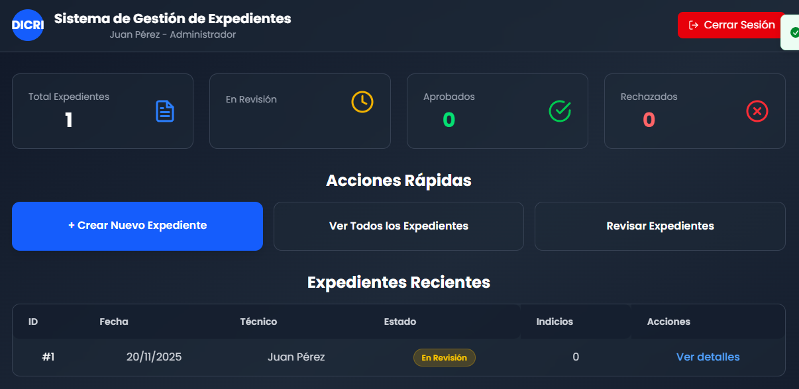

# Manual de Usuario - Sistema de Gestión de Expedientes DICRI

## Tabla de Contenidos

1. [Introducción](#1-introducción)
2. [Acceso al Sistema](#2-acceso-al-sistema)
3. [Panel Principal (Dashboard)](#3-panel-principal-dashboard)
4. [Gestión de Expedientes](#4-gestión-de-expedientes)
5. [Gestión de Indicios](#5-gestión-de-indicios)
6. [Revisión y Aprobación](#6-revisión-y-aprobación)
7. [Reportes y Consultas](#7-reportes-y-consultas)
8. [Preguntas Frecuentes](#8-preguntas-frecuentes)
9. [Solución de Problemas](#9-solución-de-problemas)
10. [Glosario](#10-glosario)

---

## 1. Introducción

### 1.1 ¿Qué es el Sistema DICRI?

El Sistema de Gestión de Expedientes e Indicios es una herramienta web desarrollada para el Departamento de Investigaciones Criminales (DICRI) del Ministerio Público de Guatemala. Permite registrar, dar seguimiento y gestionar casos forenses junto con las evidencias físicas asociadas.

### 1.2 ¿Para quién es este sistema?

El sistema está diseñado para tres tipos de usuarios:

| Rol | Descripción | Funciones Principales |
|-----|-------------|----------------------|
| **Técnico Forense** | Personal que trabaja directamente con evidencia física | • Crear expedientes<br>• Registrar indicios<br>• Actualizar información |
| **Coordinador** | Supervisor que valida el trabajo técnico | • Revisar expedientes<br>• Aprobar o rechazar casos<br>• Ver todos los expedientes |
| **Administrador** | Personal con acceso completo al sistema | • Todas las funciones anteriores<br>• Gestión de usuarios<br>• Configuración del sistema |

### 1.3 Requisitos para Usar el Sistema

**Dispositivos compatibles**:
-  Computadora de escritorio (Windows, Mac, Linux)
-  Tablet (iPad, Android)
-  Teléfono móvil (en casos de emergencia)

**Navegadores recomendados**:
-  Google Chrome (versión 100+)
-  Mozilla Firefox (versión 100+)
-  Microsoft Edge (versión 100+)
-  Safari (puede tener limitaciones)

**Conexión**:
- Internet estable
- Velocidad mínima: 5 Mbps

---

## 2. Acceso al Sistema

### 2.1 Ingreso al Sistema

**Paso 1**: Abrir el navegador web

**Paso 2**: Ingresar la dirección del sistema en caso de local 

http://localhost:5173/


**Paso 3**: Verás la pantalla de inicio de sesión


### 2.2 Iniciar Sesión

#### Usuarios de Prueba (Ambiente de Desarrollo)

Durante la fase de pruebas, puedes usar estos usuarios:

| Usuario | Contraseña | Rol |
|---------|-----------|-----|
| `admin@dicri.gob.gt` | `admin123` | Administrador |
| `tecnico1@dicri.gob.gt` | `tecnico123` | Técnico |
| `coordinador@dicri.gob.gt` | `coordinador123` | Coordinador |
| `tecnico2@dicri.gob.gt` | `tecnico123` | Técnico |

#### Proceso de Login

1. **Ingresa tu correo electrónico** en el primer campo
   - Formato: `usuario@dicri.gob.gt`
   - Ejemplo: `tecnico1@dicri.gob.gt`

2. **Ingresa tu contraseña** en el segundo campo
   - La contraseña se ocultará por seguridad (●●●●●)
   - Puedes hacer clic en el ícono del ojo  para verla temporalmente

3. **Haz clic en "Iniciar Sesión"**

4. Si los datos son correctos:
   -  Verás el mensaje "Login exitoso" en la esquina superior derecha
   - Serás redirigido al Dashboard principal

5. Si hay un error:
   -  Verás el mensaje "Credenciales inválidas"
   - Revisa que tu usuario y contraseña sean correctos


### 2.4 Cerrar Sesión

Para salir del sistema de forma segura:

1. Haz clic en el botón **"Cerrar Sesión"** en la esquina superior derecha
2. Confirmarás el mensaje "Sesión cerrada exitosamente"
3. Serás redirigido a la pantalla de login


---

## 3. Panel Principal (Dashboard)

### 3.1 Vista General del Dashboard

Al iniciar sesión, llegarás al **Dashboard** - tu centro de control principal.


#### Secciones del Dashboard



### 3.2 Tarjetas de Estadísticas

En la parte superior verás **4 tarjetas** con información resumida:

#### 1️⃣ Total de Expedientes
- **Muestra**: Cantidad total de expedientes en el sistema
- **Color**: Azul 
- **Incluye**: Todos los estados (En Revisión, Aprobados, Rechazados)

#### 2️⃣ En Revisión
- **Muestra**: Expedientes esperando aprobación
- **Color**: Amarillo 
- **Acción**: Haz clic para ver solo expedientes en revisión

#### 3️⃣ Aprobados
- **Muestra**: Expedientes validados por coordinadores
- **Color**: Verde 
- **Interpretación**: Casos cerrados exitosamente

#### 4️⃣ Rechazados
- **Muestra**: Expedientes que requieren corrección
- **Color**: Rojo 
- **Acción siguiente**: Revisar justificación y corregir

### 3.3 Acciones Rápidas

Botones principales para tareas frecuentes:

| Botón | Disponible para | Acción |
|-------|----------------|--------|
| **+ Crear Nuevo Expediente** | Técnicos y Administradores | Abre formulario de nuevo caso |
| **Ver Todos los Expedientes** | Todos los usuarios | Lista completa con filtros |
| **Revisar Expedientes** | Coordinadores y Administradores | Aprobar/rechazar casos |

### 3.4 Tabla de Expedientes Recientes

Muestra los **últimos 10 expedientes** creados o modificados:

**Columnas**:
- **ID**: Número único del expediente (ejemplo: #25)
- **Fecha**: Fecha de creación (formato: DD/MM/AA)
- **Técnico**: Nombre completo de quien lo registró
- **Estado**: 
  -  En Revisión
  -  Aprobado
  -  Rechazado
- **Indicios**: Cantidad de evidencias registradas


---

## 4. Gestión de Expedientes

### 4.1 Crear un Nuevo Expediente

#### ¿Quién puede crear expedientes?
-  Técnicos Forenses
-  Administradores

#### Proceso Paso a Paso

**Paso 1: Acceder al Formulario**

Desde el Dashboard, haz clic en **"+ Crear Nuevo Expediente"**

**Paso 2: Llenar Información Básica**


**Campos del formulario**:

| Campo | Descripción | Obligatorio | Ejemplo |
|-------|-------------|-------------|---------|
| **Técnico Asignado** | Tu nombre (automático) |  Sí | José García |
| **Descripción** | Detalles del caso |  Sí | "Caso de robo con violencia en residencia. Se encontraron 3 armas de fuego y evidencia balística..." |

**Paso 3: Redactar la Descripción**

 **Buenas prácticas**:
- Sé claro y específico
- Incluye fecha y hora del incidente
- Menciona ubicación exacta
- Lista tipos de evidencia encontrada
- Incluye nombres de involucrados (si aplica)

**Ejemplo de buena descripción**:
```
Fecha: 20 de noviembre de 2025, 14:30 hrs
Ubicación: Residencia en Zona 10, Ciudad Guatemala
Caso: Robo con violencia

Se encontraron los siguientes indicios:
- 3 armas de fuego (2 pistolas 9mm, 1 revólver .38)
- Casquillos calibre 9mm (cantidad: 7)
- Huellas dactilares en ventana de ingreso
- Fragmentos de vidrio con posible sangre

Técnico asignado: José García
Coordinador supervisor: Carlos Ramírez
```

 **Evitar descripciones vagas**:
```
"Caso de robo"  ← Muy poco descriptivo
"Encontré cosas"  ← No específica
```

**Paso 4: Crear el Expediente**

1. Revisa la información
2. Haz clic en **"Crear Expediente"**
3. Verás el mensaje:  "Expediente creado exitosamente"
4. El sistema asignará automáticamente:
   - **Número de expediente** (ejemplo: #26)
   - **Estado inicial**: "En Revisión" 
   - **Fecha actual**: 21/11/2025

**Paso 5: Siguiente Acción**

Después de crear el expediente, puedes: 
-  **Agregar indicios** (evidencia física)
-  **Ver lista de expedientes**
-  **Volver al Dashboard**

### 4.2 Ver Lista de Expedientes

#### Acceder a la Lista

Desde cualquier parte del sistema:
- Menú principal → **"Ver Todos los Expedientes"**
- Dashboard → Botón **"Ver Expedientes"**

#### Filtros Disponibles

La pantalla de expedientes tiene **dos tipos de filtros**:

#####  Filtro por Búsqueda (Texto)

```
 [Buscar por ID, técnico o descripción...]
```

**Puedes buscar por**:
- Número de expediente: `#25` o simplemente `25`
- Nombre del técnico: `José` o `García`
- Palabras en descripción: `robo`, `zona 10`, `arma`

**Ejemplo**:
- Escribir "José" mostrará todos los expedientes de José García
- Escribir "25" mostrará el expediente #25
- Escribir "robo" mostrará todos los casos con esa palabra

#####  Filtro por Estado

Opciones:
- **Todos los estados**: Muestra todo sin filtrar
- **En Revisión** : Solo expedientes pendientes
- **Aprobado** : Solo expedientes validados
- **Rechazado** : Solo expedientes que necesitan corrección

#### Tabla de Expedientes

**Columnas**:

| Columna | Información | Ejemplo |
|---------|-------------|---------|
| **ID** | Número único | #25 |
| **Fecha** | Fecha de registro | 20 nov 2025 |
| **Técnico** | Nombre completo | José García |
| **Descripción** | Resumen corto | Caso de robo con violencia... |
| **Estado** | Estado actual con color |  En Revisión |
| **Indicios** | Cantidad de evidencias | 3 |
| **Acciones** | Botones de acción | [Ver detalles] |

#### Contador de Resultados

En la parte inferior de los filtros verás:

```
Mostrando 8 de 25 expedientes
```

Esto indica:
- **8**: Expedientes que coinciden con tu filtro
- **25**: Total de expedientes en el sistema

### 4.3 Ver Detalles de un Expediente

Al hacer clic en **"Ver detalles"**, verás:

#### Información General
- Número de expediente
- Fecha de creación
- Técnico responsable
- Estado actual
- Descripción completa

#### Indicios Asociados
Lista de toda la evidencia física registrada en este expediente.

#### Historial de Revisiones
- Coordinador que revisó
- Fecha de revisión
- Decisión (Aprobado/Rechazado)
- Justificación (si fue rechazado)

### 4.4 Actualizar un Expediente

**Para actualizar**:
1. Ve a los detalles del expediente
2. Haz clic en **"Editar"**
3. Modifica la descripción
4. Guarda los cambios

 **Restricciones**:
- No puedes editar expedientes **Aprobados** 
- No puedes editar expedientes **Rechazados**  


